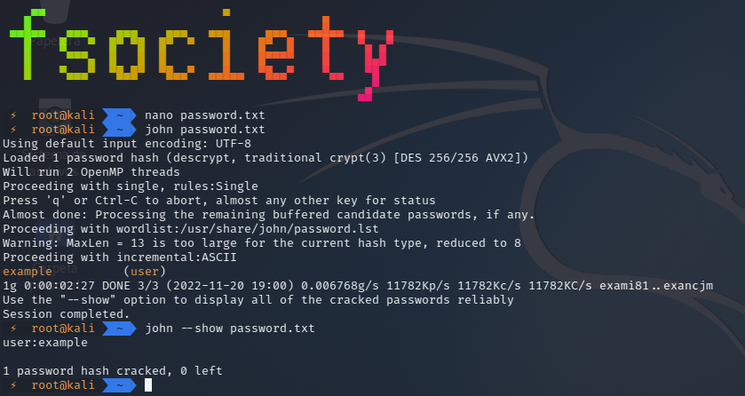

# Introducción a John the Ripper

**John the Ripper** es una herramienta de código abierto diseñada para detectar contraseñas débiles en sistemas Unix. Es altamente configurable y soporta múltiples formatos de hash.


# Instalación

## En Kali Linux:

```bash
# John viene preinstalado en Kali
john --version

# Para instalar la versión jumbo (más formatos)
sudo apt update
sudo apt install john-jumbo
```

## Ubuntu/Debian:

```bash
sudo apt update
sudo apt install john
```


# Uso Básico de John the Ripper

## Sintaxis Básica

```bash
john [opciones] [archivo_hashes]
```

## Primer Ejemplo - Archivo de Contraseñas

```bash
# Crear archivo de ejemplo
echo "usuario1:$6$salt$hashedpassword" > hashes.txt

# Ejecutar John
john hashes.txt
```

## Mostrar Contraseñas Crackeadas

```bash
# Ver resultados
john --show hashes.txt

# Ver con formato específico
john --show --format=crypt hashes.txt
```


# Formatos de Hash Soportados

## Listar Formatos Disponibles

```bash
john --list=formats
```

## Formatos Comunes

```bash
# MD5
john --format=Raw-MD5 hashes.txt

# SHA-1
john --format=Raw-SHA1 hashes.txt

# NTLM (Windows)
john --format=NT hashes.txt

# Unix DES
john --format=DES hashes.txt
```


# Tipos de Ataques con John

## Ataque de Diccionario

```bash
# Usando diccionario personalizado
john --wordlist=/usr/share/wordlists/rockyou.txt hashes.txt

# Con formato específico
john --format=Raw-MD5 --wordlist=diccionario.txt hashes.txt
```

## Ataque de Fuerza Bruta

```bash
# Fuerza bruta incremental
john --incremental hashes.txt

# Con charset específico
john --incremental=Lower hashes.txt
```

## Reglas de Mutación

```bash
# Aplicar reglas predefinidas
john --rules --wordlist=diccionario.txt hashes.txt

# Reglas específicas
john --rules=Wordlist --wordlist=diccionario.txt hashes.txt
```


# Configuración Avanzada

## Archivo de Configuración

```bash
# Ubicación del archivo de configuración
/etc/john/john.conf
~/.john/john.conf
```

## Crear Reglas Personalizadas

```conf
[List.Rules:MiRegla]
# Agregar números al final
$[0-9]$[0-9]
# Capitalizar primera letra
c
# Agregar símbolos
$!
$@
$#
```


# Herramientas Auxiliares

## Unshadow

```bash
# Combinar /etc/passwd y /etc/shadow
unshadow /etc/passwd /etc/shadow > unshadowed.txt
john unshadowed.txt
```

## Zip2john

```bash
# Extraer hash de archivo ZIP
zip2john archivo.zip > zip_hash.txt
john zip_hash.txt
```

## Rar2john

```bash
# Extraer hash de archivo RAR
rar2john archivo.rar > rar_hash.txt
john rar_hash.txt
```


### Ejemplo

Podemos cargar directamente el archivo **/etc/shadow** que contiene las contraseñas de Linux y crackearlas, sin embargo, en este ejemplo vamos a crear un documento manualmente con un usuario y una contraseña y lo usaremos con John the Ripper.

Para ello creamos un nuevo archivo de texto llamado **password.txt**:

```
user:AZl.zWwxIh15Q
```

Vamos a indicar a John que empiece a trabajar para crackear la contraseña del archivo anterior.

```
john password.txt
```

Debemos esperar hasta que la herramienta consiga crackear la contraseña del anterior archivo.

La contraseña está crackeada. Para verla simplemente debemos utilizar el siguiente comando:

```
john --show password.txt
```

<p align="center">

</p>

### Uso de diccionarios

Lo que tenemos que hacer es tener o crear un diccionario de claves personalizado.

amos a crear nosotros un diccionario sencillo, al que llamaremos «passwords.lst» y en el que introduciremos varios valores, cada uno en una línea, pero siendo uno de ellos la palabra **example**.

Simplemente debemos ejecutar John the Ripper con el parámetro –wordlist= seguido de la ruta de nuestro archivo:

```
john --wordlist=passwords.lst password.txt
```

Ahora debemos utilizar el parámetro –show para que nos muestre el resultado.

```
john --show password.txt
```

### Descifrar contraseña de archivos comprimidos

Para esto deberemos tener un diccionario y un archivo comprimido con contraseña.

Ahora debemos hacer que nos muestre la contraseña encriptada con el siguiente comando:

```
zip2john archivo.zip
```

Ahora crearemos un hash con la contraseña encriptada:

```
zip2john archivo.zip > hash.txt
```

Ahora desiframos la contraseña:

```
john --format=zip --wordlist=/root/password.lst hash.txt
```

<p align="center">

</p>

Como podemos ver hemos descifrado la contraseña de archivo .zip con la lista de contraseñas.