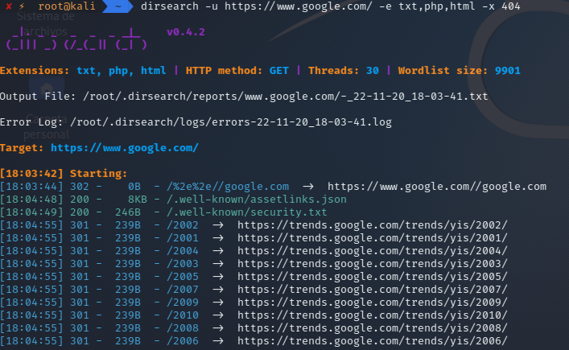

# Ecaneo de directorios web con dirsearch

Dirsearch es un escáner de directorios para aplicaciones web (diseñado en Python), que ayudara a un hacker ético a búscar información de un sitio web.

## Instalación

```
sudo apt-get install dirsearch
```

## USO

Para buscar directorios web usamos el siguiente comando:

```
dirsearch -u [url]
```

Ejemplo:

```
dirsearch -u https://www.google.com/ -e txt,php,html -x 404
```

**-u = URL Target / -e = Extensiones / -x = Estados excluidos**

<p align="center">

</p>

Una vez que acabe de escanear se generará de manera automática un archivo del escaneo realizado, en la carpeta **reports**, archivado y ordenado por target y fecha.