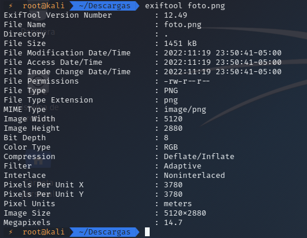

# Análisis de metadatos con Exiftool

Los metadatos o datos EXIF contienen información detallada sobre fotos, vídeos y audios digitales. Son útiles para investigaciones, ya que permiten situar eventos, identificar dispositivos usados y obtener datos relevantes. También es importante saber cómo borrar tus propios metadatos para proteger tu privacidad. Para manejar estos datos, se recomienda usar la herramienta ExifTool.

## Instalación

```
sudo apt-get install exiftool
```
## USO

Una vez lo hemos instalado, ahora toca utilizarlo en un archivo con el siguiente comando:

```
exiftool nombre_archivo
```

<p align="center">

</p>

Como podemos ver los los metadatos de la imagen como las medidas de la imagen etc.

Ahora pasamos a explicar como añadir o editar los metadatos de la imagen:

```
exiftool -rights="PRUEBA" CopyrightNotice="Filter" foto.png
```

<p align="center">

</p>

Para añadir solo escribimos un campo con un nuevo valor.

```
exiftool -description="PRUEBAAA" -CopyrightNotice="PRUEBAAA" Prueba.pdf
```

<p align="center">

</p>

Ahora primero seleccionamos el campo que deseamos editar en esta caso **Description** seleccionamos y le damos un nuevo valor.